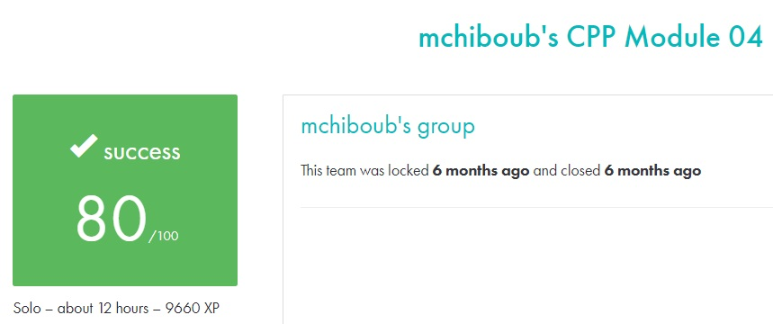

# C++ module 04 #

## What the project does: ##
The C++ - Module 04 project introduces subtype polymorphism, abstract classes, and interfaces in C++. It involves creating a hierarchy of classes that leverage polymorphism, deep copies, and abstract classes to represent animals, materia (magical elements), and characters that can interact in a fantasy-based system.

## Why the project is useful: ##
This project is useful because it explores advanced object-oriented programming concepts like polymorphism and abstract classes, which are essential for designing flexible and reusable code. It teaches how to implement interfaces and manage complex class hierarchies, skills critical for scalable software design in C++.

[Subject of this project](en.subject.pdf)